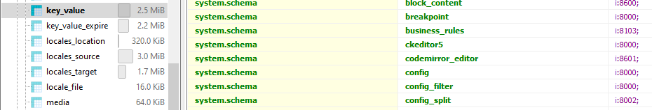

## Find hook node update information in database

```
table: key_value
column: collection
find for: 'system.schema'

```



## Bash script fix error with \r

```
sed -i 's/\r$//' filename
```


## Linux find command examples

```bash

#Find by name
find . -name “*.jpg”
...
./Pictures/iPhoto Library/Data/2006/Roll 20/00697_bluewaters_1440x900.jpg
./Pictures/iPhoto Library/Data/2006/Roll 20/00705_cloudyday_1440x900.jpg
./Pictures/iPhoto Library/Data/2006/Roll 20/00710_fragile_1600x1200.jpg
./Pictures/iPhoto Library/Data/2006/Roll 20/00713_coolemoticon_1440x900.jpg
./Pictures/iPhoto Library/Data/2006/Roll 20/00714_cloudyday_1440x900.jpg
...

#Find by User
find . -user daniel
...
./Music/iTunes/iTunes Music/Tool/Undertow/01 Intolerance.m4a
./Music/iTunes/iTunes Music/Tool/Undertow/02 Prison Sex.m4a
./Music/iTunes/iTunes Music/Tool/Undertow/03 Sober.m4a
...

#Find only directories
find . -type d
...
./Development/envelope
./Development/mhp
...

#Find everything over a megabyte in size
find ~/Movies/ -size +1024M

...
/Movies/Comedy/Funny.mpg
/Movies/Drama/Sad.avi
...

#Show me what content owned by root have been modified within the last minute
find /etc/ -user root -mtime 1

...
/etc/passwd
/etc/shadow
...

#The checks you can use here are:
#-atime: when the file was last accessed
#-ctime: when the file’s permissions were last changed
#-mtime: when the file’s data was last modified


# find all files in my directory with open permissions
find ~ -perm 777
...
~/testfile.txt
~/lab.rtf
...

#Find all files on your system that are world writeable
find / – perm -0002

#Correct the permissions on your web directory
find /your/webdir/ -type d -print0 | xargs -0 chmod 755;find /your/webdir -type f | xargs chmod 644

#Find files that have been modified within the last month and copy them somewhere
find /etc/ -mtime -30 | xargs -0 cp /a/path

#Daniel’s files of type jpeg
find . -user daniel -type f -name *.jpg

...
./Pictures/iPhoto Library/autumn_woods.jpg
./Pictures/iPhoto Library/blue_forest.jpg
./Pictures/iPhoto Library/brothers.jpg
...

Daniel’s jpeg files without autumn in the name
find . -user daniel -type f -name *.jpg ! -name autumn*

...
./Pictures/iPhoto Library/blue_forest.jpg
./Pictures/iPhoto Library/brothers.jpg
...

#Root’s ruby files accessed in the last two minutes
find /apps/ -user root -type f -amin -2 -name *.rb

...
/apps/testing.rb
/apps/runme.rb
...

```

## install nodejs on linux without sudo
```
https://www.johnpapa.net/node-and-npm-without-sudo/

Install Node.js from https://nodejs.org/en/download/

Update to the latest version of npm npm install npm -g

Make a new folder for the npm global packages mkdir ~/.npm-packages

Tell npm where to find/store them npm config set prefix ~/.npm-packages

Verify the install

Make a folder for your npm packages and tell your computer about it.

mkdir "${HOME}/.npm-packages"
echo NPM_PACKAGES="${HOME}/.npm-packages" >> ${HOME}/.bashrc
echo prefix=${HOME}/.npm-packages >> ${HOME}/.npmrc
echo NODE_PATH=\"\$NPM_PACKAGES/lib/node_modules:\$NODE_PATH\" >> ${HOME}/.bashrc
echo PATH=\"\$NPM_PACKAGES/bin:\$PATH\" >> ${HOME}/.bashrc
echo source "~/.bashrc" >> ${HOME}/.bash_profile
source ~/.bashrc

```

## Intercepting JavaScript Fetch API requests and responses

```
https://blog.logrocket.com/intercepting-javascript-fetch-api-requests-responses/
```

**Request interceptor**:

```js
const { fetch: originalFetch } = window;
window.fetch = async (...args) => {
    let [resource, config ] = args;

    // request interceptor starts
    resource = 'https://jsonplaceholder.typicode.com/todos/2';
    // request interceptor ends

    const response = await originalFetch(resource, config);

    // response interceptor here
    return response;
};


fetch('https://jsonplaceholder.typicode.com/todos/1')
.then((response) => response.json())
.then((json) => console.log(json));

// log
// {
//   "userId": 1,
//   "id": 2,
//   "title": "quis ut nam facilis et officia qui",
//   "completed": false
// }
```

**Response interceptor:**

```js
const { fetch: originalFetch } = window;
window.fetch = async (...args) => {
  let [resource, config] = args;

  let response = await originalFetch(resource, config);

  // response interceptor
  const json = () =>
    response
      .clone()
      .json()
      .then((data) => function(){
            console.log('Intercepted:', data)
            return { ...data, title: `Intercepted: ${data.title}` }
       });

  response.json = json;
  return response;
};

fetch('https://jsonplaceholder.typicode.com/todos/1')
  .then((response) => response.json())
  .then((json) => console.log(json));

// log
// {
//     "userId": 1,
//     "id": 1,
//     "title": "Intercepted: delectus aut autem",
//     "completed": false
// }
```

## Drupal print pretty json output

```php

    $form['json_data'] = [
      '#type' => 'item',
      '#title' => $this->t('JSON'),
      '#markup' => '<pre>' . json_encode($json_object, JSON_UNESCAPED_UNICODE | JSON_PRETTY_PRINT) . '</pre>',
    ];

```


## Fix Drupal/PHP/Composer patch not working on Mac OS

```
brew install gpatch
```

## Docker: Add a restart policy to a container that was already created

```
docker update --restart=always <container>
```


## Drupal custom entity basefield

```
https://fivejars.com/blog/entity-basefielddefinitions-fields-examples-drupal-8
```

### Drupal core has the following field types:

+ boolean
+ changed
+ created
+ decimal
+ email
+ entity_reference
+ float
+ integer
+ language
+ map
+ password
+ string
+ string_long
+ timestamp
+ uri
+ uuid
+ comment
+ datetime
+ file
+ image
+ link
+ list_float
+ list_integer
+ list_string
+ path
+ telephone
+ text
+ text_long
+ text_with_summary

__entity_reference__

```php

  $fields['article'] = BaseFieldDefinition::create('entity_reference')
      ->setLabel(t('Article'))
      ->setDescription(t('Article related to demo entity.'))
      ->setSetting('target_type', 'node')
      ->setSetting('handler', 'default:node')
      ->setSetting('handler_settings', [
        'target_bundles' => ['article' => 'article'],
        'auto_create' => FALSE,
      ])
      ->setRequired(TRUE)
      ->setTranslatable(FALSE)
      ->setDisplayOptions('view', [
        'label' => 'visible',
        'type' => 'string',
        'weight' => 2,
      ])
      ->setDisplayOptions('form', [
        'type' => 'entity_reference_autocomplete',
        'weight' => 2,
        'settings' => [
          'match_operator' => 'CONTAINS',
          'size' => '60',
          'placeholder' => 'Enter here article title...',
        ],
      ])
      ->setDisplayConfigurable('view', TRUE)
      ->setDisplayConfigurable('form', TRUE);
```

__string_long__

```php
$fields['notes'] = BaseFieldDefinition::create('string_long')
      ->setLabel(t('Notes'))
      ->setDescription(t('Example of string_long field.'))
      ->setDefaultValue('')
      ->setRequired(FALSE)
      ->setDisplayOptions('view', [
        'label' => 'visible',
        'type' => 'basic_string',
        'weight' => 5,
      ])
      ->setDisplayOptions('form', [
        'type' => 'string_textarea',
        'weight' => 5,
        'settings' => ['rows' => 4],
      ])
      ->setDisplayConfigurable('view', TRUE)
      ->setDisplayConfigurable('form', TRUE);
```


## Add new views filter for exist field

https://www.lilengine.co/articles/custom-views-filter-existing-daterange-field

**myfilter.module**

```php
<?php

/**
 * Implements hook_views_data_alter().
 */
function myfilter_views_data_alter(array &$data) {

  // 'node__field_myevent' is magic and must match ENTITY__FIELD_NAME.
  $data['node__field_myevent']['consultation_status'] = [
    'title' => t('Event status'),
    'filter' => [
      'title' => t('Event status'),
      'group' => t('Content'),
      'help' => t('Show future/current/past events with a filter.'),
      // This matches the real field.
      'field' => 'field_myevent_value',
      // This matches the plugin machine name.
      'id' => 'myevent_filter',
    ],
  ];

}
```

This is the the filter plugin. It lives in your module at src/Plugins/views/filter/MyEventFilter.php.

```php
<?php

namespace Drupal\myfilter\Plugin\views\filter;

use Drupal\Core\Form\FormStateInterface;
use Drupal\views\Plugin\views\filter\FilterPluginBase;

/**
 * Past/Present/Future event filter.
 *
 * @ingroup views_filter_handlers
 *
 * @ViewsFilter("myevent_filter")
 */
class MyEventFilter extends FilterPluginBase {

  /**
   * Operators.
   *
   * This may not be needed, as we don't have more than one operator. But it
   * is a pattern seen in other filters, 'opStateIs' would be a method that
   * a parent class calls during the query() method.
   */
  public function operators() {
    $operators = [
      'is' => [
        'title' => $this->t('The event is'),
        'method' => 'opStateIs',
        'short' => $this->t('Is'),
        'values' => 1,
      ],
    ];
  }

  /**
   * The form that is show (including the exposed form).
   */
  protected function valueForm(&$form, FormStateInterface $form_state) {
    $form['value'] = [
      '#tree' => TRUE,
      'state' => [
        '#type' => 'select',
        '#title' => $this->t('Event status'),
        '#options' => [
          'all' => $this->t('All'),
          'current' => $this->t('Current'),
          'past' => $this->t('Past'),
          'future' => $this->t('Future'),
        ],
        '#default_value' => !empty($this->value['state']) ? $this->value['state'] : 'all',
      ]
    ];
  }

  /**
   * Applying query filter. If you turn on views query debugging you should see
   * these clauses applied. If the filter is optional, and nothing is selected, this
   * code will never be called.
   */
  public function query() {
    $this->ensureMyTable();
    $start_field_name = "$this->tableAlias.$this->realField";
    $end_field_name = substr($start_field_name, 0, -6) . '_end_value';

    // Prepare sql clauses for each field.
    $date_start = $this->query->getDateFormat($this->query->getDateField($start_field_name, TRUE), 'Y-m-d H:i:s', FALSE);
    $date_end = $this->query->getDateFormat($this->query->getDateField($end_field_name, TRUE), 'Y-m-d H:i:s', FALSE);
    $date_now = $this->query->getDateFormat('FROM_UNIXTIME(***CURRENT_TIME***)', 'Y-m-d H:i:s', FALSE);

    switch ($this->value['state']) {
      case 'current':
        $this->query->addWhereExpression($this->options['group'], "$date_now BETWEEN $date_start AND $date_end");
        break;

      case 'past':
        $this->query->addWhereExpression($this->options['group'], "$date_now > $date_end");
        break;

      case 'future':
        $this->query->addWhereExpression($this->options['group'], "$date_now < $date_start");
        break;
    }
  }

  /**
   * Admin summary makes it nice for editors.
   */
  public function adminSummary() {

    if ($this->isAGroup()) {
      return $this->t('grouped');
    }
    if (!empty($this->options['exposed'])) {
      return $this->t('exposed') . ', ' . $this->t('default state') . ': ' . $this->value['state'];
    }
    else {
      return $this->t('state') . ': ' . $this->value['state'];
    }
  }

}
```

**Schema config**

```yml
# Lives in the module at ./config/schema/myfilter.views.schema.yml

# 'myevent_filter' should match your plugin name.
views.filter_value.myevent_filter:
  type: mapping
  label: 'Event status'
  mapping:
    state:
      type: string
      label: 'Event status'
```

## Drupal apply patch with composer.json

Run command:

```
composer require cweagans/composer-patches
```

Add patch infomation

```
"extra": {
    "patches": {
        "drupal/core": {
            "Undocumented title variable in feed-icon.html.twig": "patches/3156260-11.patch"
        }
    }
}
```

Run composer install

```
composer install
```


## Drupal Select2 use ajax callback after select item

```
public function form(array $form, FormStateInterface $form_state) {
    $form['my_item'] = [
      '#type' => 'item',
      '#markup' => 'Before Ajax',
      '#prefix' => '<div id="ajax_item_wrapper">',
      '#suffix' => '</div>',
    ];

    $form['select2'] = [
      '#type' => 'select2',
      '#title' => t('My select2 form element'),
      '#options' => ['foo', 'bar'],
      '#ajax' => [
        'callback' => [self::class, 'ajaxCallback'],
        'wrapper' => 'ajax_item_wrapper',
        'event' => 'select2:close',
      ],
    ];
}

public static function ajaxCallback($form, FormStateInterface $form_state) {
  $form['my_item']['#markup'] = 'Selected item: ' . $form_state->getValue('select2');
  return $form['my_item'];
}

```

## Change default shell user's PHP version

```
nano ~/.bash_profile

# Add end of file this line with /usr/local/php82/bin is location of PHP8.2
export PATH=/usr/local/php82/bin:$PATH 

# Save file

. ~/.bash_profile

```


## Fix openssl not working on Windows xampp

```
Click on the START button
Click on CONTROL PANEL
Click on SYSTEM AND SECURITY
Click on SYSTEM
Click on ADVANCED SYSTEM SETTINGS
Click on ENVIRONMENT VARIABLES
Under "System Variables" click on "NEW"
Enter the "Variable name" OPENSSL_CONF
Enter the "Variable value". My is - C:\xampp\apache\conf\openssl.cnf
Click "OK" and close all the windows and RESTART your computer.
The OPENSSL should be correctly working.
```

## XDEBUG 3
```
[xdebug]
zend_extension="C:\xampp\php\ext\php_xdebug-3.2.1-8.0-vs16-x86_64.dll"
xdebug.mode=debug
xdebug.client_host=127.0.0.1
xdebug.client_port="9003"
```

## Change custom entity collection page title.
```
# update file CustomEntityHtmlRouteProvider
  public function getRoutes(EntityTypeInterface $entity_type) {
    $collection = parent::getRoutes($entity_type);

    $entity_type_id = $entity_type->id();

    if ($settings_form_route = $this->getSettingsFormRoute($entity_type)) {
      $collection->add("$entity_type_id.settings", $settings_form_route);
    }

    if ($entity_collection_route = $collection->get('entity.' . $entity_type_id . '.collection')) {
      $entity_collection_route->setDefault('_title', '@label');
    }

    return $collection;
  }

```

## Drupal.t translate in Vue js

```
# Create Drupal.ts
export class Drupal {
  static t(str: string) {
    if ((window as any)?.Drupal) {
      return (window as any)?.Drupal.t(str);
    }
    return str;
  }
}

#in App.vue or other .vue files:

<script>
import {Drupal} from "~/lib/Drupal";

</script>

<template>
 <h1> Hello {{ Drupal.t('Drupal') }} </h1>
</template>

```

## Node delete confirm form alter

```php
/**
 * Implements hook_form_BASE_FORM_ID_alter().
 */
function mymodule_form_node_confirm_form_alter(&$form, FormStateInterface $form_state, $form_id) {
  // Only need to alter the delete operation form.
  if ($form_state->getFormObject()->getOperation() !== 'delete') {
    return;
  }
  /** @var \Drupal\node\NodeInterface $node */
  $node = $form_state->getFormObject()->getEntity();
  if ($node->getType() === 'page') {
    // action with node page.
  }
}
```

## Vue 3 Eventbus with Drupal

Install mitt module

```bash
npm i mitt
```

Create lib/EventBus.ts

```ts
import mitt from "mitt";
export default mitt()
```

Update main.ts
```
import { createApp } from 'vue'
import App from './App.vue'
import EventBus from "./lib/EventBus"

(window as any).EventBus = EventBus;

let app = createApp(App)
app.mount('#app')

```

Emit event in Vue component

```vue
<script lang="ts" setup>
import EventBus from "./../lib/EventBus"
const onClickHandle = () => {
 EventBus.emit("my_event", {id: 1});
}
```

Handler event in Drupal

```js
(function ($, Drupal) {

$(document).ready(function () {
   window.EventBus.on('my_event', function (data) {
     console.log(data);
   });
});

})(jQuery, Drupal);
```

## Drupal render html div with attributes

```php

$build = [
      '#type' => 'html_tag',
      '#tag' => 'div',
      '#value' => 'CONTENT FOR DIV',
      '#attributes' => [
        'id' => 'my_div_id',
        'style' => 'display: none',
      ],
]      

```

## XDebug when use drush command
```
#Open command line and input bellow before call drush command

export XDEBUG_CONFIG="idekey=PHPSTORM"

## For run in docker
export PHP_IDE_CONFIG="serverName=devdomain.local"

```

## Drush config location priority
```
//Referecen: https://github.com/drush-ops/drush/blob/9.6.0-rc3/src/Config/ConfigLocator.php#L282
// first --> last
/drush/drush.yml
$siteRoot/drush/drush.yml
$siteRoot/docroot/sites/all/drush/drush.yml

```

## Get local ip of system (example running  in docker container)

```php
$localIP = getHostByName(getHostName());
// Displaying the address 
echo $localIP;
```

## Fix Install php74-zip extension error on CentOS


```bash
pecl uninstall zip
pecl install zip
# if has error with zipconf.h
cp /usr/local/lib/libzip/include/zipconf.h /usr/local/include/zipconf.h
pecl install zip

```


## Handler json data from javascript post

```php
class MyController extends ControllerBase {
   public function handlerPost(Request $request) {
     $json = $request->getContent();
     $json = Json::decode($json);
   }
}
```


## Theme Drupal webform
Example create theme for webform id `contact`

Alter form and add webform theme function
```php
/**
 * Implements hook_form_FORM_ID_alter().
 */
function mymodule_form_webform_submission_contact_add_form_alter(&$form, FormStateInterface $form_state, $form_id) {
  $form['#theme'] = ['webform_submission_contact_add_form'];
}

/**
 * Implements hook_theme().
 */
function mymodule_theme($existing, $type, $theme, $path) {
  return [
    'webform_submission_contact_add_form' => [
      'render element' => 'form',
    ],
  ];
}

```
Create twig template file `webform-submission-contact-add-form.html.twig`

```php

  {# theme for preview page #}
  
  {# get value of text field #}
  {{ form.elements.name['#default_value'] }}
  
  {# get value of checkbox, radio options #}
  
  
  {{ options[value] }}

  
  {{ form.actions }}

  {# theme for input page #}
  {{ form.elements.name }}
  {{ form.actions }}

{{ form.form_build_id }}
{{ form.form_token }}
{{ form.form_id }}
````
Easy way add template suggestion

```php
/**
 * Suggestion based on attribute.
 *
 * @param string $base
 *   The base element.
 * @param array $suggestions
 *   The suggestions.
 * @param array $variables
 *   The variables.
 */
function mytheme_theme_suggestions_twig_attribute(string $base, array &$suggestions, array $variables) {
  if (empty($variables['element'])) {
    return;
  }
  $element = $variables['element'];
  if (isset($element['#attributes']['data-twig-suggestion'])) {
    $template = $base . '__' . $element['#type'] . '__' . $element['#attributes']['data-twig-suggestion'];
    if (!in_array($template, $suggestions)) {
      $suggestions[] = $template;
    }
  }
}

/**
 * Implements hook_theme_suggestions_HOOK_alter() for textarea.
 */
function mytheme_theme_suggestions_radios_alter(&$suggestions, $variables) {
  mytheme_theme_suggestions_twig_attribute('radios', $suggestions, $variables);
}
/**
 * Implements hook_theme_suggestions_HOOK_alter() for input.
 */
function mytheme_theme_suggestions_input_alter(&$suggestions, $variables) {
  mytheme_theme_suggestions_twig_attribute('input', $suggestions, $variables);
}
```

Add theme suggestion for webform button

```php
/**
 * Implements hook_form_FORM_ID_alter().
 */
function mymodule_form_webform_submission_contact_add_form_alter(&$form, FormStateInterface $form_state, $form_id) {
  //...
  if (isset($form['actions']['preview'])) {
    $form['actions']['preview_prev']['#attributes']['data-twig-suggestion'] = 'webform__contact__preview';
  }
  if (isset($form['actions']['preview_prev'])) {
    $form['actions']['preview_prev']['#attributes']['data-twig-suggestion'] = 'webform__contact__preview_prev';
  }
 if (isset($form['actions']['submit'])) {
  $form['actions']['submit']['#attributes']['data-twig-suggestion'] = 'webform__contact__submit';
 }
}
```

Now you can create template for button:
input--submit--webform--contact--preview.html.twig
input--submit--webform--contact--preview-prev.html.twig
input--submit--webform--contact--submit.html.twig

Example template for input--submit--webform--contact--preview.html.twig
```twig
<button {{ attributes.addClass('bnt-preview') }}>
  <span>CUSTOM PREVIEW</span>
</button>

```
## Override jsonapi output for field
```
https://medium.com/@chris.geelhoed/how-to-alter-json-responses-with-drupal-8s-json-api-and-rest-web-service-7671f9c16658
services:
  MY_MODULE.typed_data:
    class: Drupal\kc_library\Normalizer\MyNormalizerClass
    tags:
      - { name: normalizer, priority: 10 }
      
<?php
namespace Drupal\MY_MODULE\Normalizer;
use Drupal\serialization\Normalizer\TypedDataNormalizer;
/**
 * {@inheritdoc}
 */
class MyNormalizerClass extends TypedDataNormalizer {
/**
   * {@inheritdoc}
   */
  public function normalize($entity, $format = NULL, array $context = []) {
    $data = parent::normalize($entity, $format, $context);
    // transform your data here
    // You'll likely need to run some checks on the $entity or $data
    // variables and include conditionals so that only the items
    // you are interested in are altered
    return $data;
  }
}
```


## jQuery update input value and triger Vue update

```js
$("#test").val("testing")[0].dispatchEvent(new Event('input'));
```

## Drupal consle export content-type yaml config
```bash
drupal config:export:content:type --module=new_module --remove-uuid --remove-config-hash content_type_to_export
# Example
drupal config:export:content:type --module=my_module --remove-uuid --remove-config-hash article

```

## Javascript get and set properties by string
```javascript
 /* Implementation of lodash.get function */
  Object.getData = function (obj, key, def, p, undef) {
    key = key.split ? key.split('.') : key;
    for (p = 0; p < key.length; p++) {
      obj = obj ? obj[key[p]] : undef;
    }
    return obj === undef ? def : obj;
  };

  /* Implementation of lodash.set function */
  Object.setData = function(obj, keys, val) {
    keys.split && (keys=keys.split('.'));
    var i=0, l=keys.length, t=obj, x, k;
    for (; i < l;) {
      k = keys[i++];
      if (k === '__proto__' || k === 'constructor' || k === 'prototype') break;
      t = t[k] = (i === l) ? val : (typeof(x=t[k])===typeof(keys)) ? x : (keys[i]*0 !== 0 || !!~(''+keys[i]).indexOf('.')) ? {} : [];
    }
  };
  
// Example:
let obj = {
	a: {
		b: {
			c: 1,
			d: undefined,
			e: null
		}
	}
};

//use string dot notation for keys
Object.getData(obj, 'a.b.c') === 1;

//or use an array key
Object.getData(obj, ['a', 'b', 'c']) == 1;
  

var foo = { abc: 123 };
Object.setData(foo, 'foo.bar', 'hello');
// or: Object.setData(foo, ['foo', 'bar'], 'hello');
console.log(foo);
//=> {
//=>   abc: 123,
//=>   foo: { bar: 'hello' },
//=> }

```


## PHPSTORM

[Config PHPStorm for Drupal development](phpstorm.md)

## Drupal NestedArray example:

```php
$data = [
    'container' =>
    [
        'products' => [
            'edges' => [
                ['node' => ['title' => 'Node 1']],
                ['node' => ['title' => 'Node 2']],
            ]
        ]
    ]
];
// Get edges data
$edges = NestedArray::getValue($data, ['container', 'products', 'edges']);

// Get non existent data

$taxonomy = NestedArray::getValue($data, ['container', 'products', 'taxonomy']);

// $taxonomy is null

// Set value for taxonomy

NestedArray::setValue($data, ['container', 'products', 'taxonomy'], ['taxonomy1', 'taxonomy2']);


```


## BaseFieldDefinition for Drupal double_field

```
 $fields['double_field'] = BaseFieldDefinition::create('double_field')
      ->setLabel("Select Options")
      ->setSettings([
        'first' => [
          'type' => 'string',
          'label' => t('Question'),
          'maxlength' => 255,
          'list' => FALSE,
          'required' => TRUE,
        ],
        'second' => [
          'type' => 'string',
          'label' => t('Answer'),
          'maxlength' => 255,
          'list' => FALSE,
          'required' => TRUE,
        ],
      ])
      ->setDisplayOptions('form', [
        'type' => 'double_field',
        'weight' => 3,
        'settings' => ['inline' => TRUE],
      ])
      ->setDisplayOptions('view', [
        'label' => 'hidden',
        'type' => 'double_field_unformatted_list',
        'weight' => 3,
      ])
      ->setDisplayConfigurable('form', TRUE)
      ->setDisplayConfigurable('view', TRUE)
      ->setCardinality(FieldStorageDefinitionInterface::CARDINALITY_UNLIMITED);
    ;

```

## Config xdebug in vagrant
```
# config in php.ini or seprated xdebug.ini
[xdebug]
# config zend extension, can install with pecl install xdebug
zend_extension=/usr/lib/php/20190902/xdebug.so
xdebug.mode = debug
# set client host to window ip
xdebug.client_host=172.18.20.13
# client port. check phpstorm config for debug port
xdebug.client_port=9003

xdebug.idekey=PHPSTORM

```

## Fix Vagrant ssl error
```
// Add this line
Vagrant.configure("2") do |config|
  config.vm.box_download_insecure =true


```

## Drupal render entity or node field
```php

  protected function renderEntityField(FieldableEntityInterface $entity, string $field) {
    $display_options = EntityViewDisplay::collectRenderDisplay($entity, 'default')->getComponent($field);
    $build = $entity->get($field)->view($display_options);
    if (isset($build['#theme'])) {
      unset($build['#theme']);
    }
    return \Drupal::service('renderer')->renderPlain($build);
  }

```

## Drupal download remote image with http client
```php

  public function downloadImage(string $url, string $destination) {
    try {
      $result = $this->httpClient->get($url);
      if ($result->getStatusCode() == 200) {
        $tmp_file = $this->fileSystem->tempnam('temporary://', 'module_prefix_');
        $handle = fopen($tmp_file, 'w');
        fwrite($handle, $result->getBody());
        fclose($handle);
        if (is_file($tmp_file)) {
          $image_size = @getimagesize($tmp_file);
          if (empty($image_size)) {
            @unlink($tmp_file);
            return FALSE;
          }
          return $this->fileSystem->move($tmp_file, $destination, FileSystemInterface::EXISTS_REPLACE);
        }
      }
    } catch (\Exception $e) {
      $this->logger->error('Download image error: @url with message: @message', ['@url' => $url, '@message' => $e->getMessage()]);
      return FALSE;
    }
    return FALSE;
  }
  
```

## Create new file entity
```php

    $file_data = [
      'uri' => $uri,
      'uid' => \Drupal::currentUser()->id(),
      'status' => FILE_STATUS_PERMANENT,
    ];
    
    $file = File::create($file_data);
    $file->save();

```

## Add admin route for custom entity
```php
class CustomEntityHtmlRouteProvider extends AdminHtmlRouteProvider {
      public function getRoutes(EntityTypeInterface $entity_type) {
        //...
            // Add admin route for all routes.
            $collection->addOptions(['_admin_route' => TRUE]);
        //...
      }
}
```

## Ajax button with disable error message
```php
    $form['ajax_button'] = [
      '#type' => 'button',
      '#is_button' => TRUE,
      '#executes_submit_callback' => FALSE, // Disable exec submit callback
      '#limit_validation_errors' => [], // Disable validate.
      '#value' => $this->t('Update'),
      '#ajax' => [
        'callback' => [self::class, 'ajaxCallback'],
        'disable-refocus' => FALSE,
        'wrapper' => 'contents__table',
      ],
    ];
```


## Add current title to breadcrumb
```php
/**
 * Add current page to breadcrumb
 */
function THEME_NAME_preprocess_breadcrumb(&$variables) {
  if ($variables['breadcrumb']) {
    $request = \Drupal::request();
    $route_match = \Drupal::routeMatch();
    $page_title = \Drupal::service('title_resolver')->getTitle($request, $route_match->getRouteObject());
    if (!empty($page_title)) {
      $variables['breadcrumb'][] = [
        'text' => $page_title
      ];
    }
  }
}


```

## Javascript get nested property by string
```js
  function getDescendantProp (obj, desc) {
    var arr = desc.split('.');
    while (arr.length && (obj = obj[arr.shift()]));
    return obj;
  }
  // Get property drupalSettings.my_module.data without need check drupalSettings.my_module exist.
  var data = getDescendantProp(drupalSettings, 'my_module.data');
  console.log(data);
```


## Get file url relative and absolute
```php
$file_entity = File::load(1);
$relative = $file_entity->createFileUrl(); // /sites/default/files/media/images/image-1.jpg
$absolute = $file_entity->createFileUrl(false); // http://demosite.con/sites/default/files/media/images/image-1.jpg

```

## Drupal twig sort by property
```php
// Example sort taxonomy

```

## Drupal render array with cache

```php
// Cache tags with nodes

$nodes = Node::loadMultiple($nids);
$cacheTags = [];
$nodeList = [];
foreach ($nodes as $node) {
  $nodeList[] = $node->label();
  $cacheTags = Cache::mergeTags($cacheTags, $node->getCacheTags());
}
return [
  '#markup' => implode(', ', $nodeList),
  '#cache' => [
    'tags' => $cacheTags,
  ]
];

// Cache context
/* There are several others:
theme (vary by negotiated theme)
user.roles (vary by the combination of roles)
user.roles:anonymous (vary by whether the current user has the 'anonymous' role or not, i.e. "is anonymous user")
languages (vary by all language types: interface, content …)
languages:language_interface (vary by interface language — LanguageInterface::TYPE_INTERFACE)
languages:language_content (vary by content language — LanguageInterface::TYPE_CONTENT)
url (vary by the entire URL)
url.query_args (vary by the entire given query string)
url.query_args:foo (vary by the ?foo query argument
/*

return [
  '#markup' => t('WeKnow is the coolest @time', ['@time' => time()]),
  '#cache' => [
    'contexts' => ['url.query_args'],
  ]
];

// Cache “max-age”
 return [
   '#markup' => t('Temporary by 10 seconds @time', ['@time' => time()]),
   '#cache' => [
     'max-age' => 10,
   ]
 ];

```


## XDEBUG 3.0 config with PHPSTORM <= 2020.2

```
[xdebug]
zend_extension=xdebug.so
xdebug.mode = debug
xdebug.client_host = "127.0.0.1"
xdebug.client_port = 9000
xdebug.remote_connect_back = false
xdebug.var_display_max_depth = -1
xdebug.var_display_max_children = -1
xdebug.var_display_max_data = -1
```


## Complete remove mysql (mariadb) server on ubuntu


```bash
sudo apt remove --purge mysql-server
sudo apt purge mysql-server
sudo apt purge mysql-server mysql-client mysql-common mysql-server-core-* mysql-client-core-*
sudo rm -rf /etc/mysql /var/lib/mysql /var/log/mysql
```

Reinstall maridadb

```bash

sudo apt-get install mariadb-server

```


## Add jQuery core to header tag

https://stackoverflow.com/questions/41059811/is-it-possible-to-force-drupal-8-core-jquery-to-go-to-the-header

in your THEME.libraries.yml

```yml
global-styling:
  header: true
  dependencies:
    - core/jquery

```


## Drupal disable https verify when working with insecure ssl website

```php

$settings['http_client_config'] = ['verify' => FALSE];

```

## use multiple SSH private keys on one client
Edit/create file ~/.ssh/config

```bash
Host myshortname realname.example.com
    HostName realname.example.com
    IdentityFile ~/.ssh/realname_rsa # private key for realname
    User remoteusername

Host myother realname2.example.org
    HostName realname2.example.org
    IdentityFile ~/.ssh/realname2_rsa  # different private key for realname2
    User remoteusername

```
Then you can use the following to connect:
```bash
ssh myshortname

ssh myother
```

## Fix twig chmod issue

Warning: chmod(): Operation not permitted in Drupal\Component\PhpStorage\MTimeProtectedFastFileStorage

```
// Add in settings.php

$settings['php_storage']['twig']['directory'] = '/tmp/sites-caching/php';
$settings['php_storage']['twig']['secret'] = $settings['hash_salt'];
```


## Drupal Drush as phar format
```
# Drush 8 phar (Support Drupal 7 & 8)
https://github.com/drush-ops/drush/releases/download/8.4.5/drush.phar

wget https://github.com/drush-ops/drush/releases/download/8.4.5/drush.phar

php drush.phar cr

```


## Commit Changes displaying "Contents are identical" when pushing changes.

https://stackoverflow.com/questions/1580596/how-do-i-make-git-ignore-file-mode-chmod-changes

```
git config core.fileMode false

```

## Styled checkbox


```css
  .js-form-type-textfield, .js-form-type-select {
    margin-top: 10px;
    margin-bottom: 10px;

    label {
      font-weight: bold;
    }
  }
  .js-form-type-checkbox {
    display: block;
    position: relative;
  }
  .js-form-type-checkbox label {
    display: block;
    padding: 8px 0 12px 40px;
  }

  /*style and hide original checkbox*/
  .js-form-type-checkbox input {
    height: 40px;
    left: 0;
    opacity: 0;
    position: absolute;
    top: 0;
    width: 40px;
  }

  /*position new box*/
  .js-form-type-checkbox input + label::before {
    border: 1px solid;
    content: "";
    height: 35px;
    left: 0;
    position: absolute;
    top: 0;
    width: 35px;
  }

  /*create check symbol with pseudo element*/
  .js-form-type-checkbox input + label::after {
    content: "";
    border: 6px solid #fff;
    border-left: 0;
    border-top: 0;
    height: 22px;
    left: 12px;
    opacity: 0;
    position: absolute;
    top: 6px;
    transform: rotate(45deg);
    transition: opacity 0.2s ease-in-out;
    width: 12px;
  }

  /*reveal check for 'on' state*/
  .js-form-type-checkbox input:checked + label::after {
    opacity: 1;
  }

  .js-form-type-checkbox input:checked + label::before {
    background: $purple;
    border: 1px solid $purple;
  }
```

## Use Docker install Postgres for Drupal

```bash
# Pull docker postgres
docker pull postgres
# Run postgres instance
docker run --name drupal-postgres -d -p 5432:5432 -e POSTGRES_PASSWORD=postgres postgres
# Exec docker
docker exec -it drupal-postgres bash
# Create database and user;
# Login to postgres command line
psql -U postgres
# Create db and user
create database drupal;
create user drupal with encrypted password 'drupal';
grant all privileges on database drupal to drupal;
# list
\l
# delete database
DROP DATABASE drupal;

# Logout
exit;
# Import database from outside
docker exec -i drupal-postgres psql --username drupal --password drupal drupal < ./drupal-db-dump.sql

#Export database
docker exec -i drupal-postgres pg_dump -U postgres -d  drupal > ./drupal.sql

```

## Making region content available to node templates in Drupal 8
```php

/**
* Implements hook_preprocess_node() for NODE document templates.
*/
function THEME_preprocess_node(&$variables) {
  // Allowed view modes
  $view_mode = $variables['view_mode']; // Retrieve view mode
  $allowed_view_modes = ['full']; // Array of allowed view modes (for performance so as to not execute on unneeded nodes)
 
  // If view mode is in allowed view modes list, pass to THEME_add_regions_to_node()
  if(in_array($view_mode, $allowed_view_modes)) {
    // Allowed regions (for performance so as to not execute for unneeded region)
    $allowed_regions = ['primary_content'];
    THEME_add_regions_to_node($allowed_regions, $variables);
  }
}
 
/**
* THEME_add_regions_to_node
*/
 
function THEME_add_regions_to_node($allowed_regions, &$variables) {
  // Retrieve active theme
  $theme = \Drupal::theme()->getActiveTheme()->getName();
 
  // Retrieve theme regions
  $available_regions = system_region_list($theme, 'REGIONS_ALL');
 
  // Validate allowed regions with available regions
  $regions = array_intersect(array_keys($available_regions), $allowed_regions);
 
  // For each region
  foreach ($regions as $key => $region) {
 
    // Load region blocks
    $blocks = entity_load_multiple_by_properties('block', array('theme' => $theme, 'region' => $region));
 
    // Sort ‘em
    uasort($blocks, 'Drupal\block\Entity\Block::sort');
 
    // Capture viewable blocks and their settings to $build
    $build = array();
    foreach ($blocks as $key => $block) {
      if ($block->access('view')) {
        $build[$key] = entity_view($block, 'block');
      }
    }
 
    // Add build to region
    $variables[$region] = $build;
  }
}

```

Use in twig template, example node--node_type.html.twig 

```

{{ primary_content }}


```


## PHPCS disable

https://www.axelerant.com/resources/team-blog/php_codesniffer-ignoring-standards

```php
<?php
// @codingStandardsIgnoreStart
$times = array(
 60 * 60 * 12, // 12 hours.
 60 * 60 * 24, // 1 day.
 60 * 60 * 24 * 4, // 4 days.
 60 * 60 * 24 * 7, // 1 week.
 60 * 60 * 24 * 7 * 2, // 2 weeks.
 60 * 60 * 24 * 7 * 3, // 3 weeks.
 60 * 60 * 24 * 30, // 1 month.
);
// @codingStandardsIgnoreEnd

```


## Formattable Markup without translate

```php
    return new FormattableMarkup("Welcome my @site", [
      '@site' => "Drupal website",
    ]);
    
```

## Custom date format with Drupal service

```php
<?php

\Drupal::service('date.formatter')->format($timespan, 'custom', 'Y/n/j H:i');

```

## Add SSI include for apache

```
// Ubuntu, add module include for apache
sudo a2enmod include
sudo a2enmod include.load
```


```
<VirtualHost *:80>
        ServerName localhost
        ServerAdmin webmaster@localhost

        DocumentRoot /var/www/html
        <Directory /var/www/html>
                Options +Includes
                AddType text/html .html
                AddOutputFilter INCLUDES .html
                AllowOverride All
                Require all granted

        </Directory>

        # For most configuration files from conf-available/, which are
        # enabled or disabled at a global level, it is possible to
        # include a line for only one particular virtual host. For example the
        # following line enables the CGI configuration for this host only
        # after it has been globally disabled with "a2disconf".
        #Include conf-available/serve-cgi-bin.conf
</VirtualHost>

```


## Mysql windows Linux SubSystem
```
## Add new mysql user to allow access from Windows host

CREATE USER 'mysql'@'localhost' IDENTIFIED BY 'mysql';
GRANT ALL ON mysql.* TO 'mysql'@'localhost';

## Remove password validation policy

uninstall plugin validate_password;


## GRANT ALL PRIVILEGES for user.

GRANT ALL PRIVILEGES ON *.* TO 'mysql'@'localhost';

```


## Override javscript function Drupal before request ajax 

```js
(function($, Drupal, drupalSettings) {
  var _beforeSend = Drupal.Ajax.prototype.beforeSend;
  Drupal.Ajax.prototype.beforeSend = function(xmlhttprequest, options) {
    if(isMatchUrl(options.url)) {
      // Override data here
    }
    _beforeSend.call(this, xmlhttprequest, options);
  };
})(jQuery, Drupal, drupalSettings);
```


## Update Drupal module to Drupal 9

**Update module.info.yml**  
Add config core_version_requirement: ^8 || ^9  
Example
```
name: Entity Usage
type: module
description: Track usage of entities referenced by other entities.
core_version_requirement: ^8.8 || ^9
configure: entity_usage.settings.form
package: Other

```

**Remove "drupal/core" in module's composer.json**  


**Update config_export for ConfigEntity**  

core/modules/system/src/Entity/Action.php   

```
 *   config_export = {
 *     "id",
 *     "label",
 *     "type",
 *     "plugin",
 *     "configuration",
 *   }

```


## Drupal alter plugin information and definition 
https://medium.com/@djphenaproxima/how-to-bend-drupal-8-plugins-to-your-nefarious-will-94da0c31f095

```php
<?php
// Check plugin manager has alterInfo

public function __construct(\Traversable $namespaces, CacheBackendInterface $cache_backend, ModuleHandlerInterface $module_handler) {
  parent::__construct('Plugin/Filter', $namespaces, $module_handler, 'Drupal\filter\Plugin\FilterInterface', 'Drupal\filter\Annotation\Filter');
  $this->alterInfo('filter_info');
  $this->setCacheBackend($cache_backend, 'filter_plugins');
}

// Define function alter information

function mymodule_filter_info_alter(array &$definitions) {
  // Time to get schwifty in here
}

```


## Install Drupal with composer
```bash
composer create-project drupal/recommended-project my_site_name_dir
```
## Install custom module with composer

```bash
cd my_site_name_dir
chmod -R 775 web/sites/default
composer require drupal/admin_toolbar

```

## Clear page cache when change attach library 

```php
$tags[] = 'library_info';
Cache::invalidateTags($tags);

```


## Fix Install Drupal console error

+ Download latest composer.phar from https://getcomposer.org/download/
+ Move composer.phar to Drupal root directory
+ Remove folder vendor and composer.lock
+ Add "drupal/console": "~1.0" to composer.json
+ Run command php composer.phar install


## Find sub dirs of directory
```php
    $path = $this->fileSystem->realpath($dir);
    $path = rtrim($path, '/') . '/';
    $dirs = array_filter(glob($path . '*'), 'is_dir');
```

## Override Drupal Views controller
```
// https://steemit.com/drupal/@develcuy/adding-custom-contextual-links-to-a-views-page-in-drupal-8

```

## Safe url data transfer from Javascript to Drupal
```js
  Drupal.safe_encode = function(element) {
    var encode = encodeURIComponent(JSON.stringify(element));
    var base64 = Base64.encode(encode);
    base64 = base64.replace('/', '_');
    base64 = base64.replace('+', '-');
    return base64;
  };
  var base64 = Drupal.safe_encode(object);
  var url = Drupal.url('module-url?component_data='+ base64);
```

```php

function getComponentData() {
    $component_data = \Drupal::request()->query->get('component_data');
    $payload = str_replace('_', '/', $component_data);
    $payload = str_replace('-', '+', $payload);
    $payload = base64_decode($payload);
    $json = urldecode($payload);
    $json = Json::decode($json);
    return $json;
}
  
```


## Debug email with Drupal

Install module: https://www.drupal.org/project/devel_mail_logger

Add setting to file sites/default/settings.php

```php

$config['system.mail']['interface']['default'] = 'devel_mail_logger';

```

View email logged with url: admin/reports/devel_mail_logger

## Drupal schema type for config 

https://www.drupal.org/docs/8/api/configuration-api/configuration-schemametadata#types

```yml
# Undefined type used by the system to assign to elements at any level where
# configuration schema is not defined. Using explicitly has the same effect as
# not defining schema, so there is no point in doing that.
undefined:
  label: 'Undefined'
  class: '\Drupal\Core\Config\Schema\Undefined'

# Explicit type to use when no data typing is possible. Instead of using this
# type, we strongly suggest you use configuration structures that can be
# described with other structural elements of schema, and describe your schema
# with those elements.
ignore:
  label: 'Ignore'
  class: '\Drupal\Core\Config\Schema\Ignore'

# Basic scalar data types from typed data.
boolean:
  label: 'Boolean'
  class: '\Drupal\Core\TypedData\Plugin\DataType\BooleanData'
email:
  label: 'Email'
  class: '\Drupal\Core\TypedData\Plugin\DataType\Email'
integer:
  label: 'Integer'
  class: '\Drupal\Core\TypedData\Plugin\DataType\IntegerData'
float:
  label: 'Float'
  class: '\Drupal\Core\TypedData\Plugin\DataType\FloatData'
string:
  label: 'String'
  class: '\Drupal\Core\TypedData\Plugin\DataType\StringData'
uri:
  label: 'Uri'
  class: '\Drupal\Core\TypedData\Plugin\DataType\Uri'


# Container data types for lists with known and unknown keys.
mapping:
  label: Mapping
  class: '\Drupal\Core\Config\Schema\Mapping'
  definition_class: '\Drupal\Core\TypedData\MapDataDefinition'
sequence:
  label: Sequence
  class: '\Drupal\Core\Config\Schema\Sequence'
  definition_class: '\Drupal\Core\TypedData\ListDataDefinition'


# Human readable string that must be plain text and editable with a text field.
label:
  type: string
  label: 'Label'
  translatable: true

# Internal Drupal path
path:
  type: string
  label: 'Path'

# Human readable string that can contain multiple lines of text or HTML.
text:
  type: string
  label: 'Text'
  translatable: true

# PHP Date format string that is translatable.
date_format:
  type: string
  label: 'Date format'
  translatable: true
  translation context: 'PHP date format'

# HTML color value.
color_hex:
  type: string
  label: 'Color'
  
  
   Mail text with subject and body parts.
mail:
  type: mapping
  label: 'Mail'
  mapping:
    subject:
      type: label
      label: 'Subject'
    body:
      type: text
      label: 'Body'
      
      
```

## Drupal sort entity, config entity has property weight
```php
   
// ComponentCategory is Config Entity.

$categories = ComponentCategory::loadMultiple();
uasort($categories, [ComponentCategory::class, 'sort']);


```


## Drupal display date format with timezone
```php
$node = Node::load(2100);
$start_date = $node->field_date->start_date;
$formatted = \Drupal::service('date.formatter')->format($start_date->getTimestamp(), 'custom', 'Y-m-d H:i:s P', drupal_get_user_timezone());
```


## Description in radio button option value
```php

$pane_form['subscription_payment_type'] = [
      '#type' => 'radios',
      '#title_display' => 'hidden',
      '#options' => [
        'digital' => $this->t('Digital signature'),
        'paper' => $this->t('Paper form'),
      ],
      'digital' => [
        '#description' => $this->t('(E-identification or BankID)'),
      ],
      '#default_value' => 'digital',
    ];

```


## How to use entity_autcomplete Field #type in drupal 8
```php

// Autocomplete for node
$form['node'] = array(
  '#type' => 'entity_autocomplete',
  '#title' => $this->t('Entity autocomplete (using core module "EntityAutocomplete")'),
  '#target_type' => 'node',
  '#selection_settings' => array(
    'target_bundles' => array('article'),
  ),
);

// Autocomplete for user
$form['field_patient'] = array(
      '#type' => 'entity_autocomplete',
      '#title' => $this->t('Patients'),
      '#target_type' => 'user',
      '#selection_settings' => [
        'include_anonymous' => FALSE,
        'filter' => ['role' => ['patient' => 'patient']],
      ],
      '#required' => TRUE,
      '#default_value' => $node ? $node->field_patient->entity : NULL,
    );
```

## Render exposed filter of a views in Drupal 8

http://www.drupalsharing.com/code-snippets/render-exposed-filter-views-drupal-8

```php
$build = [];
$view_id = 'search';
$display_id = 'block';
$view = Views::getView($view_id);
if ($view) {
  $view->setDisplay($display_id);
  $view->initHandlers();
  $form_state = (new FormState())
    ->setStorage([
      'view' => $view,
      'display' => &$view->display_handler->display,
      'rerender' => TRUE,
    ])
    ->setMethod('get')
    ->setAlwaysProcess()
    ->disableRedirect();
  $form_state->set('rerender', NULL);
  $form_state->setCached(FALSE);
  $build[] = $this->formBuilder->buildForm('\Drupal\views\Form\ViewsExposedForm', $form_state);

```

## Drupal using hidden field it can update value by javascript
```php

 $form['hidden_data'] = ['#type' => 'hidden', '#default_value' => 'text'];

```


## Render exposed filter of a views in Drupal 8

http://www.drupalsharing.com/code-snippets/render-exposed-filter-views-drupal-8

```php
$build = [];
$view_id = 'search';
$display_id = 'block';
$view = Views::getView($view_id);
if ($view) {
  $view->setDisplay($display_id);
  $view->initHandlers();
  $form_state = (new FormState())
    ->setStorage([
      'view' => $view,
      'display' => &$view->display_handler->display,
      'rerender' => TRUE,
    ])
    ->setMethod('get')
    ->setAlwaysProcess()
    ->disableRedirect();
  $form_state->set('rerender', NULL);
  $form_state->setCached(FALSE);
  $build[] = $this->formBuilder->buildForm('\Drupal\views\Form\ViewsExposedForm', $form_state);

```


## Drupal display iframe with form api

```php

    $form['preview'] = [
      '#type' => 'inline_template',
      '#template' => '<iframe width="100%" height="315" src="{{url}}" frameborder="0" allowfullscreen></iframe>',
      '#context' => [
        'url' => 'https://www.youtube.com/embed/7TF00hJI78Y',
      ],
    ];

```


## Drupal load all node view mode
```php
  $entity_type = 'node';
  $view_modes_data['default'] = $this->t('Drupal view default');

  $view_modes = \Drupal::entityQuery('entity_view_mode')
    ->condition('targetEntityType', $entity_type)
    ->execute();
  foreach ($view_modes as $view_mode) {
    $view_mode_entity = \Drupal::entityTypeManager()
      ->getStorage('entity_view_mode')
      ->load($view_mode);
    try {
      $id = explode('.', $view_mode)[1];
      $view_modes_data[$id] = $view_mode_entity->label();
    } catch (\Exception $e) {}
  }
```

## Drupal load all blocks
```php
$blockManager = \Drupal::service('plugin.manager.block');

$contextRepository = \Drupal::service('context.repository');

// Get blocks definition

$definitions = $blockManager->getDefinitionsForContexts($contextRepository->getAvailableContexts());
$blocks_data = [];
foreach ($definitions as $block_id => $block) {
  $block_id !== 'broken' && $blocks_data[$block_id] = $block['admin_label'];
}

$print_r($blocks_data);

```


## Fix drupalSettings load error

Check missing closed div in page--*.html.twig


## Drupal disable viewsroll top 

Disable for all view with javascript

```js
Drupal.behaviors.viewsScrollOff = {
    attach: function () {
 
      /* Views Ajax Content Load Autoscroll Feature Disabled */
      Drupal.AjaxCommands.prototype.viewsScrollTop = null;
    }
  };

```

Disable for special view id

```php

function YOURMODULE_ajax_render_alter(array &$data) {
  foreach ($data as $key => &$command) {
    if ($command['command'] === 'viewsScrollTop') {
      $data_json = Json::encode($data);
      if (strpos($data_json, 'YOUR_VIEW_ID') !== FALSE) {
        unset($data[$key]);
      }
      break;
    }
  }
}
```


## Drupal sort array by weight
```php
$tests = [
  [
    'name' => 'Item 2',
    'weight' => 2,
  ],
  [
    'name' => 'Item 1',
    'weight' => 1,
  ],
];
uasort($tests, ['Drupal\Component\Utility\SortArray', 'sortByWeightElement']);
var_dump($tests);
// value of tests
$tests = [
  [
    'name' => 'Item 1',
    'weight' => 1,
  ],
  [
    'name' => 'Item 2',
    'weight' => 2,
  ],
];

```

## Drupal sort array by weight property, used in Drupal form 
```php

$tests = [
  [
    'name' => 'Item 2',
    '#weight' => 2,
  ],
  [
    'name' => 'Item 1',
    'weight' => 1,
  ],
];
uasort($tests, ['Drupal\Component\Utility\SortArray', 'sortByWeightProperty']);
var_dump($tests);
// value of tests
$tests = [
  [
    'name' => 'Item 1',
    '#weight' => 1,
  ],
  [
    'name' => 'Item 2',
    '#weight' => 2,
  ],
];
```

## Call Drupal dialog off canvas with Javascript
```js
 var ajax = new Drupal.Ajax(false, false, {
   url: '/path-to-drupal-page',
   submit: { // custom post data
     dialogOptions: {
       width: '40%',
       dialogClass: 'ui-dialog-off-canvas line-link-off-canvas'
     },
     yourdata: {name:'OffCanvas'}
   },
   dialogType : 'dialog.off_canvas'
 });
 ajax.execute().done(function () {});

```


## Drupal entity Query example
```php
// Common use of query
// user
$query = \Drupal::entityQuery('user'); 
// node
$query = \Drupal::entityQuery('node');
// taxonomy
$query = \Drupal::entityQuery('taxonomy_term');

// Load all active users
$query = \Drupal::entityQuery('user'); 
$query->condition('status', 1); 
$users_ids = $query->execute(); 
$users = User::loadMultiple($users_ids);

// Load with multiple condition
$query = \Drupal::entityQuery('user');
$query->condition('field_interests', $interests, 'IN');
$query->condition('field_birthday', $min_date->format('Y-m-d'), '<');
$query->condition('field_birthday', $max_date->format('Y-m-d'), '>');
$profils_similaires = $query->execute(); 
$users = User::loadMultiple($profils_similaires);

// Advanced usage with OR condition
$query = \Drupal::entityQuery('user');
 
$condition_or = $query->orConditionGroup();
$condition_or->condition('field_pinned',1);
$condition_or->condition('field_interests', $interests, 'IN');
 
$query->condition($condition_or);
$profils_similaires = $query->execute();
$users = User::loadMultiple($profils_similaires);

// AND OR Conditons
$query = \Drupal::entityQuery('user');
 
$condition_or = $query->orConditionGroup();
$condition_or->condition('field_pinned',1);
 
$condition_and = $query->andConditionGroup();
 
$condition_and->condition('field_interests', $interests, 'IN');
$condition_and->condition('field_birthday', $min_date->format('Y-m-d'), '<');
$condition_and->condition('field_birthday', $max_date->format('Y-m-d'), '>');
 
$condition_or->condition($condition_and);
$query->condition($condition_or);
$profils_similaires = $query->execute();
$users = User::loadMultiple($profils_similaires);


// Load node by type = product
$query = \Drupal::entityQuery('node'); 
$query->condition('type', 'produit');
// Condition with user id=1
$query->condition('uid', 1);
// zipcode LIKE 12%
$query->condition('field_adresse_zipcode', substr($code_postal, 0, 2).'%', 'LIKE');
$node_ids = $query->execute(); 
$nodes = Node::loadMultiple($node_ids);


// Query range

// 20 résultats sans en passer aucun (0)
$query->range(0, 20);
 
// 20 résultats en passant les 10 premiers (0)
$query->range(10, 20);


// Query sort
$query->sort('created', 'ASC'); //ASC or DESC

// Field sort
$query->sort('field_birthday', 'ASC');

// count

$query = \Drupal::entityQuery('node');
$query->condition('type', 'produit');
$nb_resultats = $query->count()->execute();


```


## Load all taxonomy of category
```php
// Use load tree
$vid = 'vocabulary_name';
$terms =\Drupal::entityTypeManager()->getStorage('taxonomy_term')->loadTree($vid);
foreach ($terms as $term) {
 $term_data[] = array(
  'id' => $term->tid,
  'name' => $term->name
 );
}

// Use entity query with sort condition
$vocabulary_name = 'YOUR_VOCABULARY_NAME'; //name of your vocabulary
$query = \Drupal::entityQuery('taxonomy_term');
$query->condition('vid', $vocabulary_name);
$query->sort('weight');
$tids = $query->execute();
$terms = Term::loadMultiple($tids);
```


## Drupal check current page is node detail page
```php

  $route_match = \Drupal::routeMatch();
  if ($route_match->getRouteName() == 'entity.node.canonical') {
    return true;
  }

```

## Drupal route examples

```php
// Get current route name
\Drupal::routeMatch()->getRouteName(); 
// Node detail: entity.node.canonical
// Node preview: entity.node.preview

// Current path
$current_path = \Drupal::service('path.current')->getPath();
// /about
```


## Drupal show page not found 404 and page access AccessDenie

```
// 404
if($condition){
  throw new \Symfony\Component\HttpKernel\Exception\NotFoundHttpException();
}

// 403
if($condition){
  throw new \Symfony\Component\HttpKernel\Exception\AccessDeniedHttpException();
}

```

## Drupal 8 - Creating handler request event and custom redirect using Event Subscriber

https://joehuggans.co.uk/article/drupal-8-creating-custom-redirect-using-event-subscriber


## Drupal handler response event

https://www.chapterthree.com/blog/how-to-register-event-subscriber-drupal8

Structure for the example module.

```
my_event_subscriber/
  - my_event_subscriber.info.yml
  - my_event_subscriber.services.yml
  - src/
    - EventSubscriber/
      - MyEventSubscriber.php

```

File: my_event_subscriber.info.yml

```yml
name: Register an Event Subscriber
type: module
description: 'Example: How to Register an Event Subscriber in Drupal 8'
core: 8.x
package: Other
```

File: my_event_subscriber.services.yml
```yml
services:
  my_event_subscriber:
    class: '\Drupal\my_event_subscriber\EventSubscriber\MyEventSubscriber'
    tags:
      - { name: 'event_subscriber' }
```

File: src/EventSubscriber/MyEventSubscriber.php

```php
/**
 * @file
 * Contains \Drupal\my_event_subscriber\EventSubscriber\MyEventSubscriber.
 */

namespace Drupal\my_event_subscriber\EventSubscriber;

use Symfony\Component\HttpKernel\KernelEvents;
use Symfony\Component\HttpKernel\Event\FilterResponseEvent;
use Symfony\Component\EventDispatcher\EventSubscriberInterface;

/**
 * Event Subscriber MyEventSubscriber.
 */
class MyEventSubscriber implements EventSubscriberInterface {

  /**
   * Code that should be triggered on event specified 
   */
  public function onRespond(FilterResponseEvent $event) {
    // The RESPONSE event occurs once a response was created for replying to a request.
    // For example you could override or add extra HTTP headers in here
    $response = $event->getResponse();
    $response->headers->set('X-Custom-Header', 'MyValue');
  }

  /**
   * {@inheritdoc}
   */
  public static function getSubscribedEvents() {
    // For this example I am using KernelEvents constants (see below a full list).
    $events[KernelEvents::RESPONSE][] = ['onRespond'];
    return $events;
  }

}
```

Here is a list of KernelEvents constants:
```php
KernelEvents::CONTROLLER; // The CONTROLLER event occurs once a controller was found for handling a request.
KernelEvents::EXCEPTION; // The EXCEPTION event occurs when an uncaught exception appears.
KernelEvents::FINISH_REQUEST; //The FINISH_REQUEST event occurs when a response was generated for a request.
KernelEvents::REQUEST; // The REQUEST event occurs at the very beginning of request dispatching.
KernelEvents::RESPONSE; // The RESPONSE event occurs once a response was created for replying to a request.
KernelEvents::TERMINATE; // The TERMINATE event occurs once a response was sent.
KernelEvents::VIEW; // The VIEW event occurs when the return value of a controller is not a Response instance.
```


## Drupal post. get with Guzzle library

https://drupalize.me/blog/201512/speak-http-drupal-httpclient

```php
// GET 
  $client = \Drupal::httpClient();
  $request = $client->get('http://demo.ckan.org/api/3/action/package_list');
  $response = $request->getBody();

// GET data with query parameter
  $client->request('GET', 'http://httpbin.org', [
      'query' => ['foo' => 'bar']
  ]);

// POST
  $client = \Drupal::httpClient();
  $request = $client->post('http://demo.ckan.org/api/3/action/group_list', [
    'json' => [
      'id'=> 'data-explorer'
    ]
  ]);
  $response = json_decode($request->getBody());
  
  // post form param
  $response = $client->request('POST', 'http://httpbin.org/post', [
    'form_params' => [
        'field_name' => 'abc',
        'other_field' => '123',
        'nested_field' => [
            'nested' => 'hello'
        ]
    ]
  ]);
  
// HTTP basic authentication
  $client = \Drupal::httpClient();
  $request = $client->get('https://api.github.com/user', [
    'auth' => ['username','password']
  ]);
  $response = $request->getBody();

// Exception handling

  $client = \Drupal::httpClient();

  try {
    $response = $client->get('http://demo.ckan.org/api/3/action/package_list');
    $data = $response->getBody();
  }
  catch (RequestException $e) {
    watchdog_exception('my_module', $e->getMessage());
  }


```


## Override all CSS from a library except one file

```yml
parent/parent-lib: false #removes the whole parent library

parent/parent-lib:
  css:
    css-file.css #allows you to bring back in just the file you want.

```


## Twig Save render array as variable
```twig

  
    {{ item.address_line1 }}
    {{ item.postal_code }}
    {{ item.country_code }}
  


```

## Add active class to link has parent url
```js
// Example current link: example.dev/category/subpage
// Request add active class for link with url example.dev/category

$(function(){
    var current = location.pathname;
    $('#nav li a').each(function(){
        var $this = $(this);
        // if the current path is like this link, make it active
        if($this.attr('href').indexOf(current) !== -1){
            $this.addClass('active');
        }
    })
})
```


## Open node preview in a new tab
```js
jQuery('#edit-preview').on('mouseover', function(e){
  jQuery('.node-form').attr('target', '_blank');
});
jQuery('#edit-preview').on('mouseout', function(e){
  jQuery('.node-form').removeAttr('target');
});
jQuery('#edit-preview').on('click', function(e){
  jQuery('.node-form').attr('data-drupal-form-submit-last', '');
});
```


## Theming Views in Drupal 8 with custom templates

https://jasoncote.co/theme-drupal-8-view-with-custom-templates

```
views-view--[view name]--[view display].html.twig

// Example

views-view--taxonomy--page.html.twig

```


## Drupal add/change header
```php
use Symfony\Component\HttpFoundation\Response;
$response = new Response();
$response->headers->set('Content-Type', 'text/csv; utf-8');
```

## Drupal custom field display for REST and JSON API

https://medium.com/@chris.geelhoed/how-to-alter-json-responses-with-drupal-8s-json-api-and-rest-web-service-7671f9c16658


## Drupal override replace library js css by code

http://www.monymirza.com/blog/drupal-8x-hooklibraryinfoalter-usage-example

Example library defined:
```yml
some-lib:
  header: true
  js:
    js/jsfile.min.js: {  }
```

Replace with other js file

```php
function MYMODULE_library_info_alter(&$libraries, $extension) {
  if (CONDITION) {
      $alt = ['/' . drupal_get_path('module', 'MYMODULE') . '/js/newjsfile.js' => []];
      $l['some-lib']['js'] = $alt;
  }
}
```


## Drupal replace library of core and other module

https://drupal.stackexchange.com/questions/248131/how-do-i-use-a-jquery-version-different-from-the-default-one-used-by-core

Add your custom jQuery library in your **mytheme.libraries.yml**:
```yml
jquery-custom:
  remote: https://github.com/jquery/jquery
  version: "2.2.4"
  license:
    name: MIT
    url: https://github.com/jquery/jquery/blob/2.2.4/LICENSE.txt
    gpl-compatible: true
  js:
    js/jquery-2.2.4.min.js: { minified: true, weight: -20 }
```
Then override the core jQuery library in your **mytheme.info.yml**:
```yml
libraries-override:
  # Replace an entire library.
  core/jquery: mytheme/jquery-custom
```


## Drupal CSV BOM encoding for languages (Japanese, Hebrew ...)
https://csv.thephpleague.com/9.0/interoperability/encoding/
```php
use League\Csv\Reader;

$reader = Reader::createFromPath('/path/to/my/file.csv', 'r');
//let's set the output BOM
$reader->setOutputBOM(Reader::BOM_UTF8);
//let's convert the incoming data from iso-88959-15 to utf-8
$reader->addStreamFilter('convert.iconv.ISO-8859-15/UTF-8');
//BOM detected and adjusted for the output
echo $reader->getContent();
```

## Drupal inline twig template
https://api.drupal.org/api/drupal/core%21lib%21Drupal%21Core%21Render%21Element%21InlineTemplate.php/class/InlineTemplate/8.2.x

```php
$build['hello'] = [
  '#type' => 'inline_template',
  '#template' => " Hello  <strong>{{name}}</strong>",
  '#context' => [
    'name' => $name,
  ],
];
```

## Command line remove uuid of yml file
```
sed -i '/uuid/d' ./*.yml
```

## Query for entities with language in Drupal 8
```php

$langcode = \Drupal::languageManager()->getCurrentLanguage(\Drupal\Core\Language\LanguageInterface::TYPE_CONTENT)->getId();
$query = \Drupal::entityQuery('node');
$query->condition('status', 1);
$query->condition('type', 'page');
$query->condition('langcode', $langcode);
$ids = $query->execute();

```

## Query for entities using dates in Drupal 8
https://stefvanlooveren.me/index.php/blog/entityquery-nodes-date-field-drupal-8
```php
use Drupal\Core\Datetime\DrupalDateTime;

$weekAgo = new DrupalDateTime('-7 days');
$weekAgo = $weekAgo->format(\Drupal\datetime\Plugin\Field\FieldType\DateTimeItemInterface::DATETIME_STORAGE_FORMAT);

$query = \Drupal::entityQuery('node');
$query->condition('type', 'page');
$query->condition('status', 1);
$query->condition('field_date', $weekAgo, '>=');
$results = $query->execute();
```

## Drupal send file/image response 

https://ourcodeworld.com/articles/read/329/how-to-send-a-file-as-response-from-a-controller-in-symfony-3


## Remove file from Git after add to gitignore

https://eric.blog/2014/05/11/remove-files-from-git-addingupdating-gitignore/

```
git rm --cached <file>

```

## Add node, paragraph template in module
```php
/**
 * Implements hook_theme().
 */
function MODULENAME_theme() {
    $theme['paragraph__MODULE_NAME__TYPE'] = [
        'base hook' => 'paragraph'
    ];
    return $theme;
}

/**
 * Implements HOOK_theme_suggestions_HOOK_alter().
 */
function MODULENAME_theme_suggestions_paragraph_alter(&$suggestions, $variables){
    $entity              = $variables['elements']['#paragraph'];
    $sanitized_view_mode = strtr($variables['elements']['#view_mode'], '.', '_');
    $type                = $entity->getType();

    if($type == TYPE) {
        $suggestions[] = 'paragraph__MODULENAME__' . $type;
        $suggestions[] = 'paragraph__MODULENAME__' . $type . '__' . $sanitized_view_mode;
    }
}
```

## Working with database

```php
// simple query
$database = \Drupal::database();
$query = $database->query("SELECT id, example FROM {mytable}");
$result = $query->fetchAll();

// Fetch all as Array
$result = $query->fetchAll(PDO::FETCH_ASSOC);

// query with place holder
$query = $database->query("SELECT id, example FROM {mytable} WHERE created > :created", [
  ':created' => REQUEST_TIME - 3600,
]);
```

https://drupaloutsourcing.com/blog/work-database-drupal-8
```php
#  1.The simplest sample with condition
$query = \ Drupal :: database ()->select('node_field_data', 'nfd');
$query->fields('nfd', ['uid', 'title']);
$query->condition('nfd.nid', 1);
$result = $query->execute()->fetchAll ();
```
```php
# 2. Selection of one value
$query = \ Drupal :: database ()->select ('node_field_data', 'nfd');
$query->addField('nfd', 'title');
$query->condition('nfd.nid', 1); 
$result = $query->execute ()->fetchField ();
```
```php
# 3. Sampling of the first record
$query = \ Drupal :: database ()->select ('node_field_data', 'nfd');
$query->fields('nfd', ['nid', 'title']);
$query->condition('nfd.type', 'article');
$result = $query->execute()->fetchAssoc ();
```
```php
#  4. Selection of the first column as a simple array
$query = \ Drupal :: database ()->select ('node_field_data', 'nfd');
$query->addField('nfd', 'title');
$query->condition('nfd.type', 'article');
$result = $query->execute()->fetchCol ();
```
```php
#  5. Combining the tables in the sample
$query = \ Drupal :: database ()->select ('node_field_data', 'nfd');
$query->addField('nfd', 'title');
$query->addField('ufd', 'name');
$query->join ('users_field_data', 'ufd', 'ufd.uid = nfd.uid');
$query->condition('nfd.type', 'article');
$result = $query->execute()->fetchAll ();
```
```php
#  6.Selecting a certain range of records
$query = \ Drupal :: database ()->select ('node_field_data', 'nfd');
$query->fields('nfd', ['nid', 'title']);
$query->condition('nfd.type', 'article');
$query->range (0, 10);
$result = $query->execute()->fetchAll ();
```
```php
# 7. Using the OR conditions in the sample
$condition_or = new \ Drupal \ Core \ Database \ Query \ Condition('OR');
$condition_or->condition('nfd.nid', 5);
$condition_or->condition('nfd.nid', 7);
$query = \ Drupal :: database ()->select ('node_field_data', 'nfd');
$query->fields('nfd', ['nid', 'title']);
$query->condition($ condition_or);
$result = $query->execute()->fetchAll ();
```
```php
#  8. Counting the number of records in the sample
$query = \ Drupal :: database ()->select ('node_field_data', 'nfd');
$query->fields('nfd', ['nid', 'title']);
$query->condition('nfd.type', 'article');
$result = $query->countQuery ()->execute()->fetchField ();
```
```php
# 9. Checking values for NULL
$query = \ Drupal :: database ()->select ('example', 'e');
$query->fields('e');
$query->isNull ('e.field_null');
$query->isNotNull ('e.field_not_null');
$result = $query->execute()->fetchAll ();
```
```php
# 10. Application of complex expressions in the sample
$query = \ Drupal :: database ()->select ('node_field_data', 'nfd');
$query->fields('nfd', ['nid', 'title']);
$query->addExpression ("DATE_FORMAT (FROM_UNIXTIME (nfd.created), '% e% b%
Y')", 'node_created');
$result = $query->execute()->fetchAll ();
```
```php
#  11. Grouping of sampling records
$query = \ Drupal :: database ()->select ('node_field_data', 'nfd');
$query->addField('nfd', 'type');
$query->addExpression ('COUNT (*)', 'count');
$query->groupBy ('nfd.type');
$result = $query->execute()->fetchAll ();
```
```php
#  12. Applying complex conditions in a query
$query = \ Drupal :: database ()->select ('node_field_data', 'nfd');
$query->fields('nfd', ['nid', 'title', 'type']);
$query->where ('DAY (FROM_UNIXTIME (nfd.created)) =: day', [': day' => 7]);
$result = $query->execute()->fetchAll ();
```
```php
# 13. Sort selected records
$query = \ Drupal :: database ()->select ('node_field_data', 'nfd');
$query->fields('nfd', ['nid', 'title', 'type']);
$query->orderBy ('nfd.title');
$result = $query->execute()->fetchAll ();
```
```php

• Update records

$query = \ Drupal :: database ()->update ('example');
$query->fields([
'field_1' => $ value_1,
'field_2' => $ value_2,
'field_3' => $ value_3,
]);
$query->condition('field_4', $ value_4);
$query->execute `();
```
```php
• Using complex expressions when updating

$query = \ Drupal :: database ()->update ('example');
$query->expression ('field_1', 'field_1 +: amount', [': amount' => 100]);
$query->expression ('field_3', 'field_2');
$query->execute();
```
```php
• Adding one record
$query = \ Drupal :: database ()->insert ('example');
$query->fields([
'field_1' => $ value_1,
'field_2' => $ value_2,
'field_3' => $ value_3,
]);
$query->execute();
```
```php
• Adding multiple entries
$values = [
[$value_1, $value_2, $value_3],
[$value_4, $value_5, $value_6],
[$value_7, $value_8, $value_9],
];
$query = \ Drupal :: database ()->insert ('example');
$query->fields(['field_1', 'field_2', 'field_3']);
foreach ($values as $record) {
$query->values($record);
}
$query->execute();
```
```php
• Add or update depending on the availability of the record
$query = \ Drupal :: database ()->upsert ('example');
$query->fields(['field_id', 'field_1']);
$query->values ([$ id, $value_1]);
$query->key ('field_id');
$query->execute();
```
```php
• Delete
$query = \ Drupal :: database ()->delete ('example');
$query->condition('field', $value);
$query->execute();


```


## Setting allow Drupal upload javascript file and other extension
```
// settings.php

$config['system.file']['allow_insecure_uploads'] = TRUE;

```

## cURL error 60: SSL certificate problem
```
Download: http://curl.haxx.se/ca/cacert.pem 
Save it in a: "cacert.pem"
Edit php.ini
curl.cainfo = "[pathtothisfile]\cacert.pem"

```


## Route nolink
```
route:<nolink>
```

## Get view route name
https://www.computerminds.co.uk/drupal-code/drupal-8-views-how-formulate-route-name

```
view.$view_id.$display_id
```


## Library working with CSV
```
https://csv.thephpleague.com/

// Read CSV to array
https://csv.thephpleague.com/8.0/reading/

// Insert data to CSV
https://csv.thephpleague.com/8.0/inserting/

```

## Drupal textarea no wrap text
```php
    $form['textarea_name'] = [
      '#title' => $this->t('Textarea Title'),
      '#type' => 'textarea',
      '#attributes' => ['style' => ['white-space:nowrap']],
    ];

```

## Config entity and translate config
```php
https://www.drupal.org/node/1905070
```

## Drupal Entity API cheat sheet
```php
// https://www.metaltoad.com/blog/drupal-8-entity-api-cheat-sheet
// Load a node by NID:
$nid = 123;     // example value
$node_storage = \Drupal::entityTypeManager()->getStorage('node');
$node = $node_storage->load($nid);

// Get a built-in field value:
echo $node->get('title')->value;           // "Lorem Ipsum..."
echo $node->get('created')->value;         // 1510948801
echo $node->get('body')->value;            // "The full node body, <strong>with HTML</strong>"
echo $node->get('body')->summary;          // "This is the summary"
// a custom text field
echo $node->get('field_foo')->value;       // "whatever is in your custom field"
// a file field
echo $node->get('field_image')->target_id; // 432 (a managed file FID)

echo $node->title->value;            // "Lorem Ipsum..."
echo $node->created->value;          // 1510948801
echo $node->body->value;             // "This is the full node body, <strong>with HTML</strong>"
echo $node->body->summary;           // "This is the summary"
echo $node->field_foo->value;        // "whatever is in your custom field"
echo $node->field_image->target_id;  // 432

// Paragraphs
$my_paragraph = null;
 
foreach ($node->get('field_paragraph_reference') as $para) {
  if ($para->entity->getType() == 'your_paragraph_type') {   // e.g., "main_content" or "social_media"
    $my_paragraph = $para->entity;
  }
}
 
if (!empty($my_paragraph)) {
  // $my_paragraph is a regular entity and can be interacted with like any other entity
  echo $my_paragraph->field_somefield->value;
 
  // (however, they don't have a "title" like a node)
  echo $my_paragraph->title->value;  // <-- this won't work
} else {
  echo "The node doesn't have this paragraph type.";
}

// Working with File entities
$fid = 42;      // example value
$file_storage = \Drupal::entityTypeManager()->getStorage('file');
$file = $file_storage->load($fid);

echo $file->getFileUri();   // "public://file123.jpg"
// if you want the URL without Drupal's custom scheme, you can translate it to a plain URL:
echo file_url_transform_relative(file_create_url($file->getFileUri()));   // "/sites/default/files/public/file123.jpg"
echo $file->filename->value;   // "file123.jpg"
echo $file->filemime->value;   // "image/jpeg"
echo $file->filesize->value;   // 63518  (size in bytes)
echo $file->created->value;    // 1511206249  (Unix timestamp)
echo $file->changed->value;    // 1511234256  (Unix timestamp)
echo $file->id();              // 432

// The file's user data
echo $file->uid->target_id;               // 1
echo $file->uid->value;                   // <-- doesn't work. Use target_id instead.
echo $file->uid->entity->name->value;     // "alice"
echo $file->uid->entity->timezone->value; // "America/Los_Angeles"

// Working with Entity References
foreach ($node->field_my_entity_reference as $reference) {
 
  // if you chose "Entity ID" as the display mode for the entity reference field,
  // the target_id is the ONLY value you will have access to
  echo $reference->target_id;    // 1 (a node's nid)
 
  // if you chose "Rendered Entity" as the display mode, you'll be able to 
  // access the rest of the node's data.
  echo $reference->entity->title->value;    // "Moby Dick"
 
}
// Populate the value of an entity reference field which allows multiple values (this replaces any existing value in the DB)
$nids = [3,4,5,6];   // example value
$node->set('field_my_entity_reference', $nids);
$node->save();

// Append new referenced items to an entity reference field (this preserves existing values)
$nids = [3,4,5,6];   // example value
foreach ($nids as $nid) {
  $node->field_my_entity_reference[] = [
    'target_id' => $nid
  ];
}
$node->save();

```


## Drupal queue 
```php
https://www.sitepoint.com/drupal-8-queue-api-powerful-manual-and-cron-queueing/
```

## Javascript get url query params
```php
$.urlParam = function (name) {
    var results = new RegExp('[\?&]' + name + '=([^&#]*)')
                      .exec(window.location.search);

    return (results !== null) ? results[1] || 0 : false;
}

console.log($.urlParam('ref')); //registration
console.log($.urlParam('email')); //bobo@example.com

```


## List all block and id
```php
drush ev "print_r(array_keys(\Drupal::service('plugin.manager.block')->getDefinitions()));"
```


## Validator for checking the field depending on the value of another field
```php
https://makedrupaleasy.com/articles/drupal-8-custom-validator-checking-field-depending-value-another-field
```

## Drupal theme Views Exposed Filters form

```php
https://makedrupaleasy.com/articles/drupal-8-make-beautiful-views-exposed-filters-form-custom-twig-template-and-bootstrap
```

## Drupal theme form

Example for create theme for form id **'my_awesome_form'** with module/theme **example**

```php
function example_theme() {
  return [
    'my_awesome_form' => [
      'render element' => 'form',
    ],
  ];
}
```

Create template templates/**my-awesome-form**.html.twig in example module

```php
{{ form.form_build_id }} # alway require
{{ form.form_token }} # alway require
{{ form.form_id }} # alway require

<div class="row">
  <div class="col-md-6">
    {{ form.name }}
  </div>
  <div class="col-md-6">
    {{ form.address }}
  </div>
</div>
```

### Tips
Render form element without div wrapper

```php
{{ form.name|without('#theme') }}
{{ form.name|without('#theme_wrappers') }}
```

Replace string or class of element
```php

{{ form_name|replace({'old_class':'new_class'})|raw }}
```


## Drupal common entity route 

### Node Route

| Links Key | Route Name | Route Example URI | Code Example |
| --- | --- | --- | --- |
| canonical | entity.node.canonical | /node/1 | Url::fromRoute('entity.node.canonical') |
| add-page | entity.node.add_page | /node/add | Url::fromRoute('entity.node.add_page') |
| add-form | entity.node.add | /node/add/article | Url::fromRoute('entity.node.add', ['node_type' => 'article']) |
| edit-form | entity.node.edit_form | /node/node/1/edit | Url::fromRoute('entity.node.edit_form', ['node' => $nid]) |
| delete-form | entity.node.delete_form | /node/1/delete | Url::fromRoute('entity.node.delete_form', ['node' => $nid]) |
| collection | entity.node.collection | /admin/content | Url::fromRoute('entity.node.collection') |
| latest_version | entity.node.latest_version | /node/1/latest | Url::fromRoute('entity.node.latest_version', ['node' => $nid]) |
| revision | entity.node.revision | /node/1/revisions/2/view | Url::fromRoute('entity.node.revision', ['node' => $nid, 'node_revision' => 2]) |
| list revisions | entity.node.version_history | /node/1/revisions | Url::fromRoute('entity.node.version_history', ['node' => $nid]) |
| node preview | entity.node.preview | /node/preview/uuid/full | Url::fromRoute('entity.node.preview', ['node_preview' => $uuid, 'view_mode_id' => 'full']) |


## Drupal create link with target blank
```php
// Use route
$options = ['absolute' => TRUE, 'attributes' => ['target' => '_blank']];
$link_object = Drupal\Core\Link::createFromRoute(t('the general terms and conditions of business'),
    'entity.node.canonical', ['node' => "123"],
    $options);
$link = $link_object->toString();

// Use url
$options = ['absolute' => TRUE, 'attributes' => ['target' => '_blank']];
$link_object = Link::fromTextAndUrl('Detail', Url::fromUserInput('/node', $options));
$link = $link_object->toString();

```

## Drupal logger object as array
```php
   \Drupal::logger('module_name')->notice('<pre><code>' . print_r($array_to_print, TRUE) . '</code></pre>'    );
```

## Drupal form ajax command
```
https://www.drupal.org/docs/8/api/javascript-api/ajax-forms
https://www.drupal.org/docs/8/api/ajax-api/core-ajax-callback-commands
https://www.drupalexp.com/blog/creating-ajax-callback-commands-drupal-8
```

## Override service class
```
https://kevinquillen.com/overriding-services-drupal-8-serviceprovidebase
https://www.bounteous.com/insights/2017/04/19/drupal-how-override-core-drupal-8-service/
```

## Theme suggestions
```
https://sqndr.github.io/d8-theming-guide/theme-hooks-and-theme-hook-suggestions/theme-hook-suggestions.html
```

## Theme preprocess
```
https://developpeur-drupal.com/en/article/theme-preprocess-and-suggestions-drupal-8-bootstrap-sub-theme
```

## Twig function for Drupal 8
https://danielmg.org/php/twig-cheatsheet.html

https://www.drupal.org/docs/8/theming/twig/functions-in-twig-templates

https://www.drupal.org/docs/8/modules/twig-tweak/cheat-sheet


```php
# Base Syntax
Output: {{ … }}
Base tag: 
Comments: {# … #}
Array: ['hello', 'world', 3]
Hash: {'name': 'Tyrion', 'age': 5}

# Setting Variables

Sets a variable value: 

Append or merge Strings or arrays:



Setting a default vale if foo is not previously defined


# Including other Templates

Simple include:


# architect is theme name

Inlcude with custom vars:




# Macros

{# _macros.twig #}

    Foo and {{ var }}


If you've defined the macros in the same file, you need to import them, using _self: 

{# mytemplate.twig #}

{{ m.foo('bar') }}

# Simple "If/Else" control

    Kenny is sick.

    You killed Kenny! You bastard!!!

    Kenny looks okay --- so far


# Simple "For" control


    
    {{ u.name }}

    No active users.


With a conditional:


With a filter:


Get current url
{{ url('<current>') }}

Get url as array


Get current theme path


Get current theme name


Check user permission

  ... do something



```

### Twig batch for array chunk
```php


<table>

    <tr>
        
            <td>{{ column }}</td>
        
    </tr>

</table>
```
The above example will be rendered as:
```php
<table>
    <tr>
        <td>a</td>
        <td>b</td>
        <td>c</td>
    </tr>
    <tr>
        <td>d</td>
        <td>e</td>
        <td>f</td>
    </tr>
    <tr>
        <td>g</td>
        <td>No item</td>
        <td>No item</td>
    </tr>
</table>
```

### Twig column
```php




{# fruits now contains ['apple', 'orange'] #}
```


## Check request is admin route
```php
if (\Drupal::service('router.admin_context')->isAdminRoute()) {
 // do stuff
}

```
Reference: https://drupal.stackexchange.com/a/219371/1542


## List Drupal 8 form api elements
```php
https://api.drupal.org/api/drupal/elements/8.7.x
https://drupalize.me/tutorial/form-element-reference?p=2766
```

## Add ajax for reset button in exposed filter views
```php
/**
 * Implements hook_form_BASE_FORM_ID_alter().
 */
function MODULE_form_views_exposed_form_alter(&$form, FormStateInterface $form_state, $form_id) {
  $storge = $form_state->getStorage();
  if (!empty($storge['view']) && $storge['view']->id() === 'my_view') {
    if (isset($form['actions']['reset']) && isset($form['actions']['submit'])) {
      $submit_id = $form['actions']['submit']['#id'];
      $form['actions']['reset']['#attributes']['onclick'] = 'javascript:jQuery(this.form).clearForm();jQuery("#' . $submit_id . '").trigger("click");return false;';
    }
  }
}

```
## Use Drupal Ajax Command with javascript 
```js
var ajax = new Drupal.Ajax(false, false, {
  url: Drupal.url('path/to/controller')
});
ajax.execute().done(function () {
  alert('Done');
});
```

## Letencrypt
```php
https://gist.github.com/flashvnn/82f8707b141b6adfee998d9588fac927
```

## Drupal 8 install offline with other language

Issue:
```
 [ERROR] Internet: The translation server is offline.

The installer requires to contact the translation server to
         download a translation file. Check your internet connection and verify that your website can reach the
         translation server at http://ftp.drupal.org.
```

```php
https://drupal.stackexchange.com/questions/164172/problem-installing-in-local-the-translation-server-is-offline
Copy translate file to folder sites/default/files/translations
```

## File with Drupal 8

```php
// Move file entity.
$file = \Drupal\file\Entity\File::load($fid);
file_move(FileInterface $source, 'public://newlocation/demo.jpg');

```

## Edit Drupal config
```php
  $config_factory = \Drupal::configFactory();
  $langcode = $config_factory->get('system.site')->get('langcode');
  $config_factory->getEditable('system.site')->set('default_langcode', $langcode)->save();
```

## Check entity bundle has translated
```php
  if(!\Drupal::has('content_translation.manager')){
    return false;
  }
  $content_translation_manager = \Drupal::service('content_translation.manager');
  $compatible = $content_translation_manager->isEnabled('node', 'general');
```


## Get list field of bundle
```php
$entityManager = \Drupal::service('entity_field.manager');
$fields= $entityManager->getFieldDefinitions($entity_type, $bundle);
```

## Get entity bundle of entity type
```php
  /**
   * Get entity bundle options.
   *
   * @param $entity_type_id
   *   The entity type identifier.
   *
   * @return array
   *   An array of entity bundle options.
   */
  protected function getEntityBundleOptions($entity_type_id) {
    $options = [];

    foreach ($this->entityTypeBundleInfo->getBundleInfo($entity_type_id) as $name => $definition) {
      if (!isset($definition['label'])) {
        continue;
      }
      $options[$name] = $definition['label'];
    }

    return $options;
  }
  
  // Get all node type
  $node_types = $this->getEntityBundleOptions('node');
```


## Set default value for view filter
```php
/**
 * Implements hook_form_BASE_FORM_ID_alter().
 */
function MODULE_form_views_exposed_form_alter(&$form, FormStateInterface $form_state, $form_id) {
  $storge = $form_state->getStorage();
  if ($storge['view']->id() === 'view_news') {
    if (isset($form['changed_date_select']['#options']) && count($form['changed_date_select']['#options']) > 1) {
      if (isset($form['changed_date_select']['#options']['All'])) {
        $user_input = $form_state->getUserInput();
        if (isset($user_input['changed_date_select']) && $user_input['changed_date_select'] === 'All') {
          next($form['changed_date_select']['#options']);
          $key = key($form['changed_date_select']['#options']);
          $form['changed_date_select']['#default_value'] = $key;
          $user_input['changed_date_select'] = $key;
          $form_state->setUserInput($user_input);
        }
      }
    }
  }

}
```

## Check if request is ajax request
```php

$request = \Drupal::request();
$is_ajax = $request->isXmlHttpRequest();

```


## Check request is AJAX Form Request
```php
$request->query->has(static::AJAX_FORM_REQUEST))
```

### Add basic authetication for /user url
```
# Add in virtualhost config
<Location /user>
  AuthUserFile /home/path/.htpasswd
  AuthName "Password Protected Area"
  AuthType Basic
  Require valid-user
</Location>

```

## Config php.ini setting for local development
```ini
max_execution_time = 300
max_input_time = 300
max_input_vars = 100000
memory_limit = 2048M
post_max_size = 48M
upload_max_filesize = 48M
```
## Config mysql.ini for development
```ini
symbolic-links=0
innodb_file_per_table = 1
thread_concurrency = 8
query_cache_size = 32M
thread_cache_size = 8
myisam_sort_buffer_size = 64M
read_rnd_buffer_size = 16M
read_buffer_size = 8M
sort_buffer_size = 8M
table_open_cache = 512
max_allowed_packet = 32M
key_buffer_size = 384M
```


## Install Acquia Dev Desktop
Install Microsoft Visual C++ 2010 Redistributable Package before run Acquia Dev Desktop
```
https://www.microsoft.com/en-us/download/details.aspx?id=14632
https://www.microsoft.com/en-us/download/details.aspx?id=5555
```

## Issue: Drupal Console PHP Fatal error:  require(): Failed opening required 'drupal.php'
Check PHP installed with ionCube, need remove it 

## Issue: Drupal console: The “--shellexec_output” option does not exist
Remove the line with shellexec_output: true from ~/.console/config.yml (probably the last line in the file).

## Install composer 

```bash
curl -sS https://getcomposer.org/installer -o composer-setup.php
sudo php composer-setup.php --install-dir=/usr/local/bin --filename=composer
```

## Install drupal console global
```bash
curl https://drupalconsole.com/installer -L -o drupal.phar
mv drupal.phar /usr/local/bin/drupal
chmod +x /usr/local/bin/drupal
```

## Render array Properties
**#type, #theme, and #markup**
Almost every Render API element at any level of the render array's hierarchy will have one of these properties defined.

**#plain_text**

Specifies that the array provides text that needs to be escaped.
Example:
```
'#plain_text' => t('Hello world!')
```
