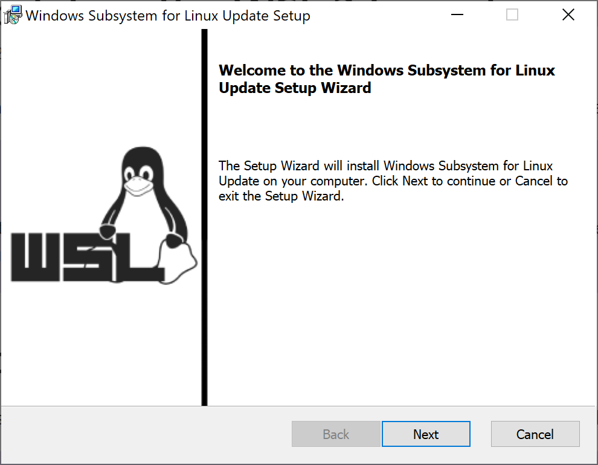

# LAMP stack setup using WSL - Ubuntu 18.04 for Drupal developer

<div style="text-align:center">


</div>

## Install Ubuntu 18.04
* Enable WSL

Before installing any Linux distributions on Windows, you must enable the "Windows Subsystem for Linux" optional feature.

Open PowerShell as Administrator and run:

```sh
dism.exe /online /enable-feature /featurename:Microsoft-Windows-Subsystem-Linux /all /norestart
```


* Download and install unbuntu app [here](
https://www.microsoft.com/store/productId/9N9TNGVNDL3Q)

### Comparing WSL 1 and WSL 2
https://docs.microsoft.com/en-us/windows/wsl/compare-versions

### Updating the WSL 2 Linux kernel
https://docs.microsoft.com/en-us/windows/wsl/wsl2-kernel



### Result


----------
### Upgrade

```sh
sudo apt-get update
sudo apt-get upgrade -y
```

### Add repository

```sh
sudo add-apt-repository ppa:ondrej/php
```

### Install apache

```sh
sudo apt-get install apache2 -y
```


### Install php7.2

```sh
sudo apt-get install -y php7.2-cli php7.2-curl php7.2-xml php7.2-mbstring php7.2-bz2 php7.2-gd php7.2-mysql libapache2-mod-php7.2 mysql-client unzip git
```

### Install mysql
```sh
sudo apt install mysql-server -y
sudo mysql service restart
sudo mysql_secure_installation
sudo mysql
```

```sql
SELECT user,authentication_string,plugin,host FROM mysql.user;
```

```
+------------------+-------------------------------------------+-----------------------+-----------+
| user             | authentication_string                     | plugin                | host      |
+------------------+-------------------------------------------+-----------------------+-----------+
| root             |                                           | auth_socket           | localhost |
| mysql.session    | *THISISNOTAVALIDPASSWORDTHATCANBEUSEDHERE | mysql_native_password | localhost |
| mysql.sys        | *THISISNOTAVALIDPASSWORDTHATCANBEUSEDHERE | mysql_native_password | localhost |
| debian-sys-maint | *9A87AEB418F5B967B6811C80D83E34CD96AF3137 | mysql_native_password | localhost |
+------------------+-------------------------------------------+-----------------------+-----------+
```

```sql
ALTER USER 'root'@'localhost' IDENTIFIED WITH mysql_native_password BY 'P@ssw0rd';
FLUSH PRIVILEGES;
```

```
+------------------+-------------------------------------------+-----------------------+-----------+
| user             | authentication_string                     | plugin                | host      |
+------------------+-------------------------------------------+-----------------------+-----------+
| root             | *8232A1298A49F710DBEE0B330C42EEC825D4190A | mysql_native_password | localhost |
| mysql.session    | *THISISNOTAVALIDPASSWORDTHATCANBEUSEDHERE | mysql_native_password | localhost |
| mysql.sys        | *THISISNOTAVALIDPASSWORDTHATCANBEUSEDHERE | mysql_native_password | localhost |
| debian-sys-maint | *9A87AEB418F5B967B6811C80D83E34CD96AF3137 | mysql_native_password | localhost |
+------------------+-------------------------------------------+-----------------------+-----------+

exit;
````

**Create new mysql user (Optional)**

```
mysql -u root -p
```

```sql
CREATE USER 'drupal'@'localhost' IDENTIFIED BY 'password';
GRANT ALL PRIVILEGES ON *.* TO 'drupal'@'localhost' WITH GRANT OPTION;
```

```
exit;
```

### Composer
```sh
php -r "copy('https://getcomposer.org/installer', 'composer-setup.php');"
php composer-setup.php
sudo mv composer.phar /usr/local/bin/composer
```

### Nodejs

```sh
curl -sL https://deb.nodesource.com/setup_10.x | sudo -E bash -
sudo apt-get install -y nodejs
```

### Configuring Git

```sh
git config --global user.email "you@example.com"
git config --global user.name "Your Name"
```

### Create Drupal site using acquia/blt
```
composer create-project --no-interaction acquia/blt-project myproject
```

```
Creating BLT templated files...
> /home/ypx/myproject/vendor/acquia/blt/bin/blt internal:create-project --ansi
> blt:init:settings
Generating hash salt...
[File\Write] Writing to /home/ypx/myproject/salt.txt.
> blt:init:shell-alias
BLT can automatically create a Bash alias to make it easier to run BLT tasks.
This alias will be created in /home/ypx/.bashrc.
Installing blt alias...
Added alias for blt to /home/ypx/.bashrc.
You may now use the blt command from anywhere within a BLT-generated repository.
Restart your terminal session or run source /home/ypx/.bashrc to use the new command.
```

Continue with blt config and command.
* Config `blt.yml` set admin account

```yml
...
drupal:
  account.name: admin
  account.mail: admin@example.com
  locale: en
```
* Change config `docroot/sites/default/settings/local.settings.php`
* Install site with `blt setup`

### Create symbolic link

```sh
sudo ln -s /home/ypx/myproject/ /var/www/html/myproject
```

### Config vhost
```sh
sudo cp /etc/apache2/sites-available/000-default.conf /etc/apache2/sites-available/myproject.conf
sudo nano /etc/apache2/sites-available/myproject.conf
```

**File content**

```cnf
<VirtualHost *:80>
        ServerName local.myproject.com
        ServerAdmin webmaster@localhost
        DocumentRoot /var/www/html/myproject/docroot

        <Directory /var/www/html/myproject/docroot>
                Options -Indexes +FollowSymLinks
                AllowOverride All
                Require all granted
        </Directory>

        ErrorLog ${APACHE_LOG_DIR}/error.log
        CustomLog ${APACHE_LOG_DIR}/access.log combined
</VirtualHost>
```
1) Restart apache2

```
sudo service apache2 restart
```

2) Edit host file
Get IP address of wsl

```sh
ifconfig
```

```cnf
eth0: flags=4163<UP,BROADCAST,RUNNING,MULTICAST>  mtu 1500
        inet 172.24.147.82  netmask 255.255.240.0  broadcast 172.24.159.255
        inet6 fe80::215:5dff:feb4:1269  prefixlen 64  scopeid 0x20<link>
        ether 00:15:5d:b4:12:69  txqueuelen 1000  (Ethernet)
        RX packets 971  bytes 89739 (89.7 KB)
        RX errors 0  dropped 0  overruns 0  frame 0
        TX packets 77  bytes 34353 (34.3 KB)
        TX errors 0  dropped 0 overruns 0  carrier 0  collisions 0
```

```
Window + R
C:\Windows\System32\drivers\etc\hosts
```
**Add new line**

```cnf
172.24.147.82       local.myproject.com
```

Access site


## References:
1. [Windows Subsystem for Linux Installation Guide for Windows 10](https://docs.microsoft.com/en-us/windows/wsl/install-win10)
2. [Installing Acquia BLT](https://docs.acquia.com/blt/install/)
3. [How To Install MySQL on Ubuntu 18.04](https://www.digitalocean.com/community/tutorials/how-to-install-mysql-on-ubuntu-18-04)

----

## Apendix

### 1. Reset root user password wsl

```
Window + X + A
wsl -u root
passwd
```

### 2. Install xdebug
* Install
```sh
sudo apt-get install php7.2-xdebug
```

* Config

```sh
sudo nano /etc/php/7.2/cli/conf.d/20-xdebug.ini
```
Add end of file
```cnf
xdebug.profiler_enable = 0
xdebug.remote_enable=1
xdebug.remote_host=localhost
xdebug.remote_port=9000
xdebug.remote_handler=dbgp
xdebug.max_nesting_level=500
```

* Resart apache

```
sudo service apache2 restart
```

### 3. Switch PHP version
<a name="pookie"></a>
Switch From PHP 7.2 => PHP 7.3

Apache:

```
sudo a2dismod php7.2
sudo a2enmod php7.3
sudo service apache2 restart
```

Commands

```
sudo update-alternatives --set php /usr/bin/php7.3
sudo update-alternatives --set phar /usr/bin/phar7.3
sudo update-alternatives --set phar.phar /usr/bin/phar.phar7.3
sudo update-alternatives --set php-config /usr/bin/php-config7.3
```

### 4. Install phpmyadmin

```
sudo apt-get install phpmyadmin
```

```log
The following NEW packages will be installed:
  dbconfig-common dbconfig-mysql javascript-common libapache2-mod-php7.4 libjs-jquery libjs-sphinxdoc libjs-underscore
  libzip4 php php-php-gettext php-phpseclib php-tcpdf php-zip php7.4 php7.4-zip phpmyadmin
```

PHP version switch to 7.4
So we need to switch to your php version again.

### 5. Apache command

* Start apache
```
sudo service apache2 start
```

* Restart apache
```
sudo service apache2 restart
```

* Reload config apache
```
sudo service apache2 reload
```

* Stop apache
```
sudo service apache2 stop
```

### 6. Mysql command
 
* Start mysql
```
sudo /etc/init.d/mysql start
```
* Stop mysql
```
sudo /etc/init.d/mysql stop
```
